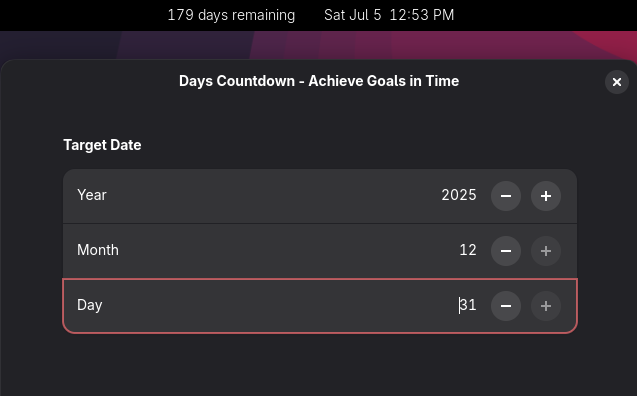

# Days Countdown ⏳

A simple GNOME Shell extension that shows days left to your chosen date in the top bar.


## Features
- Minimal and clean
- Days remaining display
- Easy to set target date
## Supported GNOME Versions
45, 46, 47, 48, 49

## Install
1. Clone:
    ```
    git clone https://github.com/paudelsamir/countdown-gnome-extension.git
    ```
2. Zip the folder:
    ```
    zip -r countdown@paudelsamir.github.io.zip *
    ```
3. Extract to `~/.local/share/gnome-shell/extensions/countdown@paudelsamir.github.io`
4. Restart GNOME Shell (Alt+F2, type `r`, Enter) or logout/login.
5. Enable:
    ```
    gnome-extensions enable countdown@paudelsamir.github.io
    ```

## Set Target Date
Edit `extension.js`:
```js
const targetDate = new Date(2025, 11, 10); // Dec 10, 2025
```
